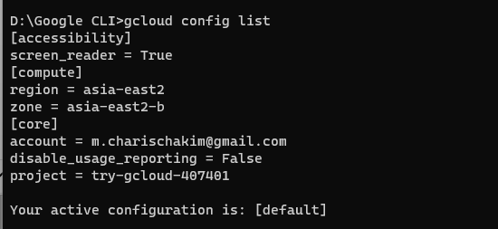
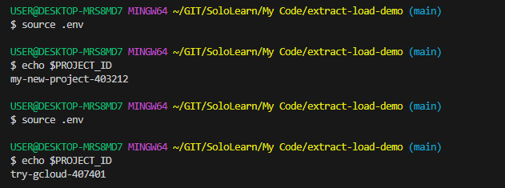

# TASK 1
task hari ini.
buat script python untuk extract data dari file .json yang ada di GCS --> load data yang sudah di extract ke bigquery

example:

file json di gcs = [
    {"name": "djamier", "age": 20},
    {"name": "elon musk", "age": 30}
]

table di big query =
name            age
djamier         20
elon musk    30

# Ans
Pertama kita buat project dan bucket di GCP sebagai wadah yang akan kita gunakan dalam task ini.

Buat dataset table di bigquery

Buat tabel sesuai data yang akan kita inputkan

Buat file .env sesuai nama project dan bucket yang kita buat 

Login ke akun GCP menggunakan google cloud shell SDK dan pastikan project yang aktif telah sesuai dengan yang akan kita kerjakan

Jalankan file .env sebelum menjalankan file python

Jalankan file python task1_charis.py

Cek data via UI cloud

#END

 