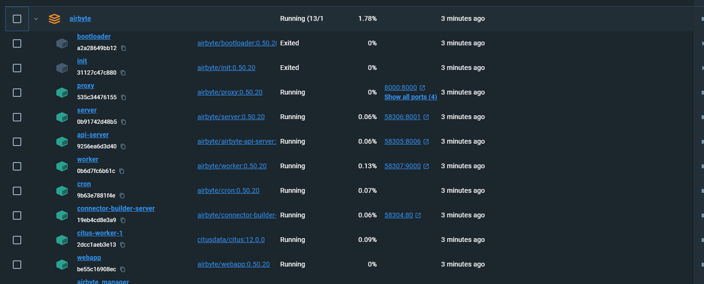
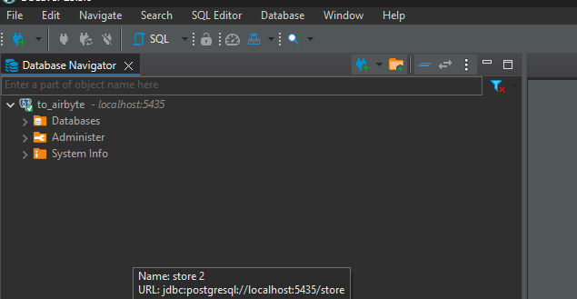
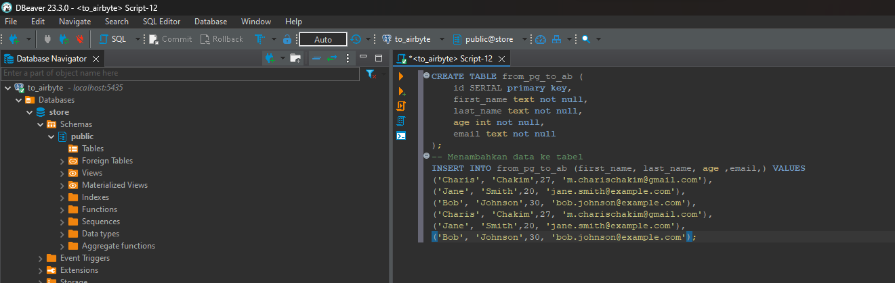
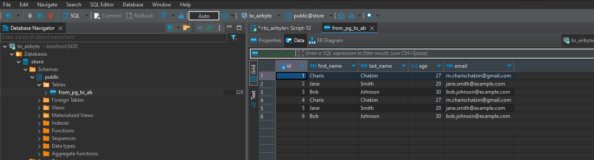
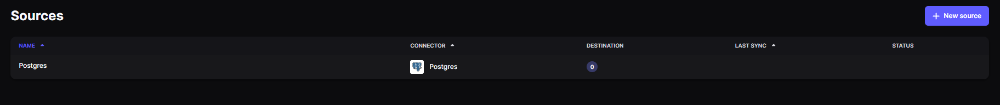
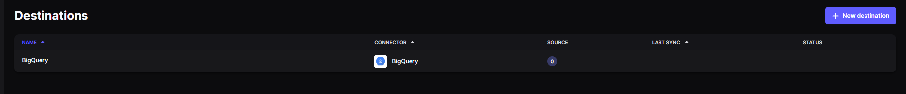
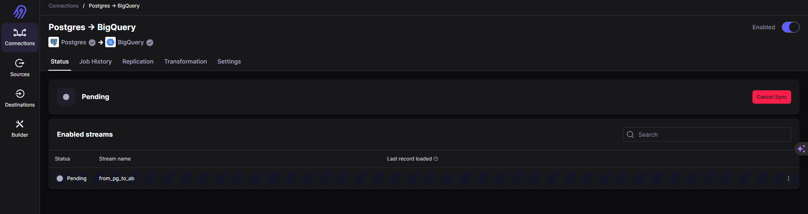
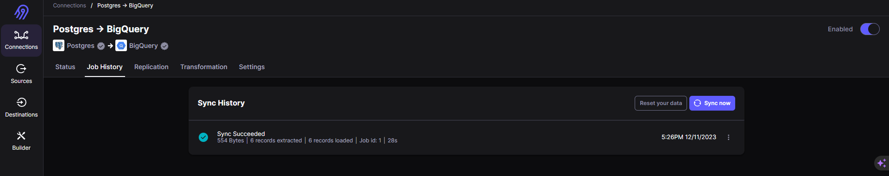
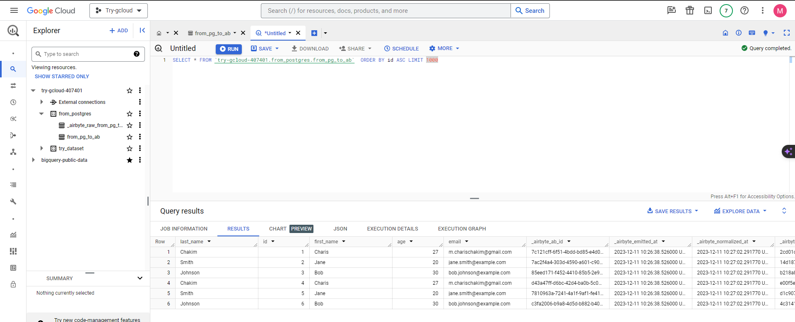

# TASK 2
untuk task day 2.
Ingest data from postgres to bigquery using airbyte:
 - SS Source yang sudah kalian buat
 - SS Destination yang sudah kalian buat
 - SS Connection yang sudah kalian buat
 - SS Hasil data yang sudah di load ke bigquery

data di bigquery jumlah row nya bebas ya. Tapi row pertama harus nama kalian masing2.

# ANS
Jalankan docker compose dimana konfigurasi image dan container sesuai dengan yang kita butuhkan.

Koneksikan ke postgresql dengan dbeaver dengan konfigurasi sesuai pada file docker compose

Buat tabel dan insert data di postgresql

Buat Source Postgres

Sebelum kita membuat destinasi ke BigQuery pastikan service account untuk airbyte sudah ada dan sudah generate key yang akan dimasukkan ke destination airbyte nantinya.

Buat destionation

Buat connection dan lakukan syncronize

Result

# END

