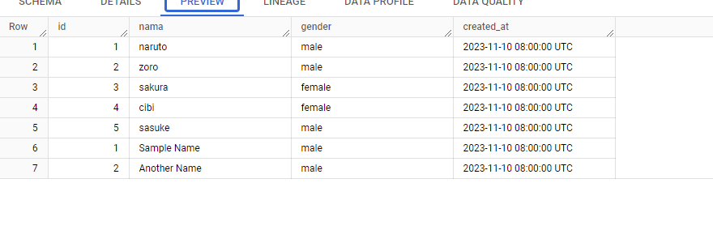

# TASK 3
Lakukan sesuai module day 3

# ANS
Create environment untuk composer API GCP, sebelum membuat environtmentnya pastikan composer API sudah enable. Jika sudah ter-enable maka tampilan akan seperti ini. Pilih Composer 1 atau 2 bebas, disini saya memilih composer 1

Isi form untuk membuat environment composer sesuai yang kita mau

Tunggu sekitar 20-30 menit ketika proses ini berjalan

environment composer telah siap

Upload DAG

Run DAG

Result

Delete DAG

# END

